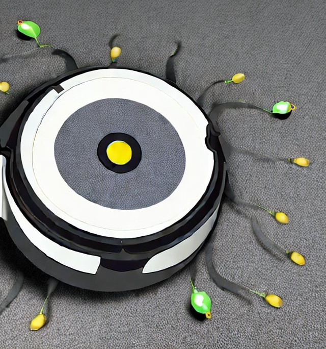

# Hi, Gregor : control your Roomba

Copyright 2023 Kenshi Muto



## 概要

ルンバにコマンドを送る小さなプログラムです。

- `node dist/hi-gregor.js status`: ルンバの動作状態とバッテリの値を返す
- `node dist/hi-gregor.js start`: 清掃を開始する
- `node dist/hi-gregor.js dock`: ドックに戻る

## 注意

ローカルAPIしか使えないため、LAN内の機器間のみでしか通信できません。ポストだけでなく、Slackなどと双方向に連携したいときには、インターネット上のサーバーとLANをやりとりする仕組みが別途必要になります。

## ビルドとインストール

```
$ npm install
$ npx tsc
```

実行前に、環境変数を設定してください。

- `IROBOT_BLID`: アクセスに使うID
- `IROBOT_PASS`: アクセスに使うパスワード

以下のコマンドで取得できます。

```
$ npx roomba-sdk-creds ルンバのLAN内でのIPアドレス
```

ルンバのホームボタンを長押ししてメロディが鳴ってから、上記のコマンド実行画面でEnterキーを押すと、IDとパスワードが表示されます。

詳細については以下を参照してください。

[How to get your username/blid and password](https://www.npmjs.com/package/roomba-sdk?activeTab=readme#how-to-get-your-usernameblid-and-password)

## Overview

A tiny program that sends commands to the Roomba.

- `node dist/hi-gregor.js status`: get the status and the battery value
- `node dist/hi-gregor.js start`: start cleaning
- `node dist/hi-gregor.js dock`: back to the dock

## Notice
Since roomba-sdk can only use local APIs, this program can also only communicate between devices within the LAN.
If you want to not only post but also interact with Slack, etc., you will need a custom mechanism to communicate with servers on the Internet and your LAN.

## Build & Install

```
$ npm install
$ npx tsc
```

Set environment variables before running.

- `IROBOT_BLID`: access ID
- `IROBOT_PASS`: access password

These can be obtained with the following command.

```
$ npx roomba-sdk-creds <Roomba's-local-IP-address>
```

Press and hold the home button on the Roomba until the melody sounds, then press Enter key at the command execution screen shown above. The ID and password will now be displayed.

See for details.

[How to get your username/blid and password](https://www.npmjs.com/package/roomba-sdk?activeTab=readme#how-to-get-your-usernameblid-and-password)

## ライセンス / License

```
Permission is hereby granted, free of charge, to any person obtaining a
copy of this software and associated documentation files (the "Software"),
to deal in the Software without restriction, including without limitation
the rights to use, copy, modify, merge, publish, distribute, sublicense,
and/or sell copies of the Software, and to permit persons to whom the
Software is furnished to do so, subject to the following conditions:

The above copyright notice and this permission notice shall be included in
all copies or substantial portions of the Software.

THE SOFTWARE IS PROVIDED "AS IS", WITHOUT WARRANTY OF ANY KIND, EXPRESS OR
IMPLIED, INCLUDING BUT NOT LIMITED TO THE WARRANTIES OF MERCHANTABILITY,
FITNESS FOR A PARTICULAR PURPOSE AND NONINFRINGEMENT.  IN NO EVENT SHALL
SOFTWARE IN THE PUBLIC INTEREST, INC. BE LIABLE FOR ANY CLAIM, DAMAGES OR
OTHER LIABILITY, WHETHER IN AN ACTION OF CONTRACT, TORT OR OTHERWISE,
ARISING FROM, OUT OF OR IN CONNECTION WITH THE SOFTWARE OR THE USE OR OTHER
DEALINGS IN THE SOFTWARE.
```
